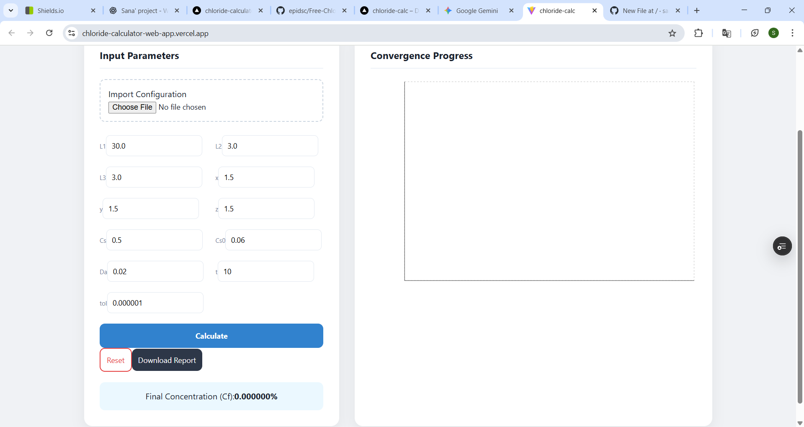
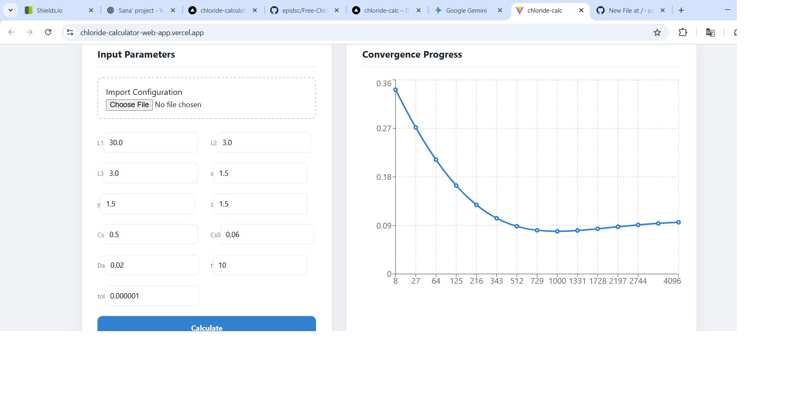

# Free Chloride Concentration Calculator (Web App)


A web-based application for calculating free chloride concentration (Cf) in concrete, converted from a Python desktop GUI.  
It provides interactive input, real-time graphing, and PDF export for academic and research purposes.

---

## 🔬 Scientific Background

Chloride ingress in concrete is a critical durability concern, especially in marine or saline environments.  
The **free chloride concentration (Cf)** at a location and time determines the risk of reinforcement corrosion.

This web app computes Cf(x, y, z, t) using a **multi-dimensional Fourier series expansion of Fick’s second law**, with adaptive convergence based on a user-defined tolerance.  
The methodology is based on **X. Qiu et al., 2024**.

---

## ✨ Features

- Responsive web interface using React
- Fourier-series solution for chloride ingress
- Adaptive series truncation for efficiency
- Fast vectorized computation
- Real-time convergence plotting using Recharts
- Manual input or batch input via `.txt` / `.csv` files
- Export results as PDF
- Outputs final chloride concentration and number of Fourier terms used

---

## 🖥️ Screenshots

**Input Page**  


**Results Page**  


> Replace the image paths with your actual screenshots in `./assets/screenshots/`

---

## ⚙️ Technologies Used

- **Frontend:** React with Vite, Tailwind CSS  
- **Graphing:** Recharts  
- **PDF Export:** jsPDF, html2canvas  

---

## 💻 Installation (Development)

1. Clone the repository:

```bash
git clone https://github.com/your-username/chloride-calculator-web.git
Go to the project folder:

bash
Copy code
cd chloride-calculator-web
Install dependencies:

bash
Copy code
npm install
Start the development server:

bash
Copy code
npm run dev
Open your browser at http://localhost:5173/

🚀 Usage
Enter parameters in the web interface:

Parameter	Description
L1, L2, L3	Domain dimensions (cm)
x, y, z	Spatial position (cm)
Cs	Surface chloride concentration (%)
Cs0	Initial chloride concentration (%)
Da	Apparent diffusion coefficient (cm²/year)
t	Exposure time (years)
Tolerance	Series convergence criterion (optional)

Click Calculate

View results and the convergence graph

Optional: Load input from .txt or .csv

Click Export PDF to download results

📜 Export Results as PDF
After calculation, click the Export PDF button

The app generates a PDF containing input parameters, results, and graphs

Download the PDF to your computer

👥 Authors
T. Sanojan – Converted to Web UI & frontend

U. Sanathanan – Original Python GUI development

Git Repo: Free Chloride Concentration Calculator

🙏 Acknowledgments
Converted from Python desktop GUI under the guidance of Dr. D.A.S. Amarasinghe

Mathematical derivation based on X. Qiu et al., 2024

📖 References
[1] X. Qiu, J. Yuan, W. Chen, X. Tan, G. Wu, H. Tian, “Effect of chloride binding and sulfate ion attack on chloride diffusion in calcium sulfoaluminate-based material under seawater environment,” Journal of Materials Research and Technology, vol. 30, pp. 4261–4271, Apr. 2024. doi: 10.1016/j.jmrt.2024.04.139